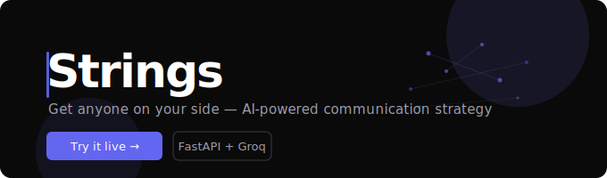

<div align="center">



[](https://fastapi.tiangolo.com)
[](https://groq.com)
[](https://strings-6xn8.onrender.com)
[](./LICENSE)

**[→ Try it live](https://strings-6xn8.onrender.com)**

</div>

---

## What it does

You're about to have a difficult conversation — with your boss, partner, parent, or teacher. You know what you want, but not how to get there.

**Strings** takes your situation and generates a concrete, psychologically grounded strategy: what to say, when to say it, and how to open the conversation — adapted to the person and your goal.

---

## How it works

1. **Pick who you're dealing with** — boss, colleague, partner, parent, friend, teacher
2. **Set your goal** — convince, stop unwanted behaviour, resolve a conflict, improve the relationship
3. **Choose a tone** — diplomatic, direct, assertive, gentle, or strategic
4. **Describe the situation** — in your own words
5. **Get your strategy** — step-by-step plan + a word-for-word conversation opener

---

## Stack

| Layer | Tech |
|---|---|
| Backend | FastAPI (Python) |
| AI | Groq API — `gpt-oss-120b` |
| Frontend | Vanilla HTML / CSS / JS |
| Hosting | Render |
| Rate limiting | SlowAPI (10 req/min per IP) |

---

## Run locally

```bash
git clone https://github.com/r1laun/Strings.git
cd Strings
pip install -r requirements.txt
```

Create a `.env` file:

```env
GROQ_API_KEY=gsk_your_key_here
```

Start the server:

```bash
uvicorn main:app --reload
```

Open `http://localhost:8000`

---

## API

```
POST /api/strategy
```

```json
{
  "situation": "My boss keeps skipping my 1-on-1s and I need to address it",
  "person_type": "boss",
  "goal_type": "convince",
  "tone": "assertive"
}
```

Returns a structured strategy with numbered steps, a key insight, and a ready-to-use conversation opener.

---

## License

MIT © [r1laun](https://github.com/r1laun)

---

<div align="center">
  <sub>Built by <a href="https://github.com/r1laun">@r1laun</a></sub>
</div>
